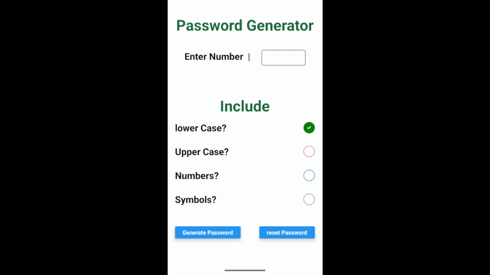
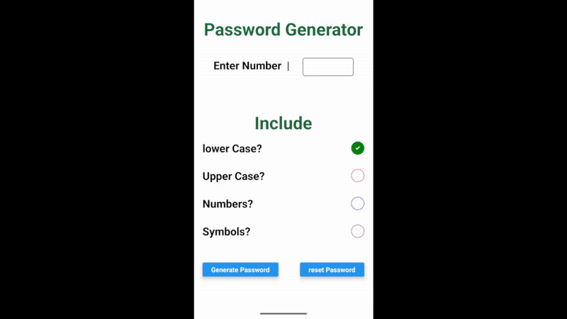
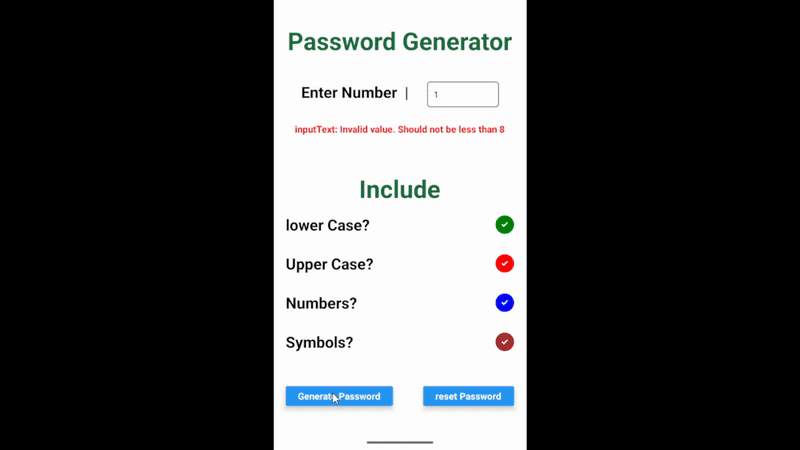

# Simple Password Generator App example App using React native
In this app you will be able to create a random app generator by selecting options for including
* Lowercase
* Uppercase
* numbers
* symbols

After selecting checkbox for character type to include in checkbox. Enter the number for how many character password you want to create by including checkbox.
 After click button to generate password.

### Reeact-Native components used
* Usestate management
* form validation 
* random passwordgeneration module
* style sheet
* custom theme using colorScheme()

## Npm packages used 
* Bouncy check Box for check box  animation

if you you want to use this package too copy the below code and run on terminal on your react projects
<pre><code>npm i react-native-bouncy-checkbox</code></pre>

## AppScreen  Shots


### Generate password and card render if generated password


### form validation 


### reset form

```typescript


function main():void{
    // custom key example and how to operate on it 
const customkeylist:mykeys={
    key1:25,
    key2:26,
    key3:27,

}
// loop to read and write the custom keys 
for(const keys in customkeylist){

    console.log(keys+':'+customkeylist[keys])
}
// deleting keys 
delete customkeylist.key2;
console.log(customkeylist)
// adding  keys
customkeylist.key4=88
console.log(customkeylist)


}


interface mykeys{
    [key:string]:number
}


main();

```

